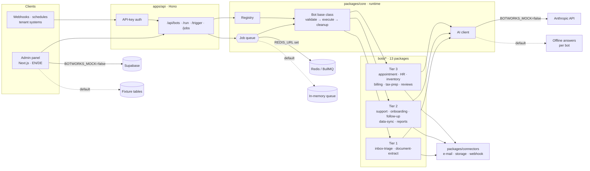

# botworks — a modular AI bot platform for small businesses

[](https://github.com/GodSmasher/botworks/actions/workflows/ci.yml)

> **Status: Showcase project — runtime, 13 bots, REST API and admin panel are complete and run fully offline in mock mode.**

**Live demo → [botworks-psi.vercel.app/dashboard](https://botworks-psi.vercel.app/dashboard)** · no login, mock data only · switch EN/DE in the sidebar


Run everything locally — no API key, no Redis, no database:

```bash
npm install
npm run demo       # all 13 bots, offline, through the real queue and parsers
npm run dev        # admin panel → http://localhost:3100
npm run dev:api    # REST API     → http://localhost:4000
```

---

## The problem

Small companies drown in repetitive back-office work: sorting the shared inbox, typing invoice data into the accounting tool, chasing unanswered offers, preparing receipts for the tax advisor. Off-the-shelf automation tools cover single steps, and every "AI assistant" built for one customer ends up as a one-off script that nobody can operate, monitor or reuse for the next customer.

## The solution

botworks treats each task as a **bot with a contract** and runs all of them on one shared runtime:

- **One interface per bot** — `manifest` (identity, tier, required connectors), `validate(input)` (zod), `execute(ctx, input)`.
- **The runtime does the rest** — queueing, priorities, retries with backoff, connector injection, structured logging, error isolation.
- **Multi-tenant by design** — every company only gets the bots and connectors it actually needs; an admin panel shows tenants, bot fleet, connector health, billing and compliance across all of them.
- **Runs without infrastructure** — every AI call ships a deterministic offline answer that still passes the bot's real response schema, and the queue falls back to memory when no Redis is configured.

## Architecture



**Design decisions worth a look**

- **Offline answers go through the real parser.** `aiJson({ ..., parse, mock })` serializes the bot's offline result and feeds it to the same zod `parse` a live model answer would hit ([`packages/core/src/ai.ts`](packages/core/src/ai.ts)). The mocks are small heuristics over the actual input — keyword classification, date arithmetic, sums — not canned constants, so changing the sample input changes the output.
- **Two queues, one contract.** `createQueue()` returns BullMQ on Redis when `REDIS_URL` is set and an in-memory queue otherwise. Both implement `JobQueue` with priorities, bounded concurrency and three attempts with exponential backoff ([`packages/core/src/queue.ts`](packages/core/src/queue.ts)).
- **A database stand-in instead of a second code path.** The admin panel talks to Supabase through the usual query builder. In mock mode the same calls hit an in-memory client that implements exactly the operations the panel uses ([`apps/admin/src/lib/mock/client.ts`](apps/admin/src/lib/mock/client.ts)), so no page knows about mock mode.
- **Bots fail alone.** A bot returns a structured `JobResult` for validation errors, missing connectors and exceptions; one broken job never takes the worker down.
- **gettext-style i18n.** English source strings are the keys, German lives in per-page dictionaries, missing entries fall back to English.

## The bots

| Tier | Bot | What it does |
|---|---|---|
| 1 — core | `inbox-triage` | Classifies incoming e-mail by category and priority, extracts entities, applies routing rules |
| 1 — core | `document-extract` | Classifies documents and extracts structured data from invoices, contracts and letters |
| 2 — standard | `customer-support` | Answers questions from a knowledge base, cites sources, escalates on low confidence or sensitive topics |
| 2 — standard | `onboarding` | Normalizes master data and plans its distribution to target systems |
| 2 — standard | `follow-up` | Three-stage reminder sequences with escalation |
| 2 — standard | `data-sync` | Reconciles records between two systems and resolves conflicts |
| 2 — standard | `report-generator` | Builds reports from raw data with an executive summary |
| 3 — industry | `appointment` | Finds slots from free-text wishes, sends reminders |
| 3 — industry | `employee-mgmt` | Vacation, sick leave and master-data requests with approval rules |
| 3 — industry | `inventory` | Stock, expiry and slow-mover alerts with reorder suggestions |
| 3 — industry | `billing` | Invoices from time entries, staged dunning with late fees |
| 3 — industry | `tax-prep` | Categorizes receipts for the tax advisor, flags items for review |
| 3 — industry | `review-analysis` | Sentiment, themes and recommendations from customer reviews |

Each bot ships `src/sample.ts` (an invented input) and `src/mock.ts` (its offline heuristics).

The walkthrough GIF above is generated with `npm run demo:record` (Playwright + ffmpeg, see `scripts/record-demo.mjs`).

## Design

The admin UI concept lives in Figma: [botworks – UI Redesign Concept](https://www.figma.com/design/zssQp5nKuqvlaBgkJW3tLJ) — five screens (dashboard, sales pipeline, analytics, finance & commissions, settings) that the admin panel and a field-sales frontend are derived from.

## Admin panel

`apps/admin` — Next.js 14, server components, English with a German switch. Pages: platform dashboard, tenants and tenant detail, analytics, bot fleet with live status and logs, connectors with sync history, route bot (proximity-based visit suggestions for field staff), users, billing, compliance, reports, system health, settings.

## API

```bash
curl localhost:4000/api/bots                                   # list manifests
curl -X POST localhost:4000/api/bots/inbox-triage/run \
     -H 'content-type: application/json' \
     -d '{"companyId":"demo","input":{"emails":[{"id":"1","from":"a@example.com","to":["b@example.com"],"subject":"Invoice 4711","body":"Please find our invoice attached."}]}}'
curl -X POST localhost:4000/api/bots/inbox-triage/trigger ...   # async → { jobId }
curl localhost:4000/api/bots/jobs/<jobId>                      # result once finished
```

Set `API_SECRET` to require `X-API-Key` on `/api/*`.

## Tests

`npm test` runs the vitest suite offline (no API key, no Redis, no database).
Covered: the in-memory queue (priorities, retries, depth), the AI mock path, all 13 bots with their sample inputs, input validation, the admin panel's mock query builder and the REST API routes driven in-process.

## Tech stack

**Runtime** TypeScript · zod · BullMQ / Redis · Anthropic SDK
**API** Hono on Node.js
**Admin** Next.js 14 (App Router) · React 18 · Tailwind CSS · Supabase
**Tooling** npm workspaces · tsx · tsup · Docker Compose (Redis)

## Repository layout

```
apps/admin/            Admin panel (mock database client, EN/DE)
apps/api/              REST API, bot registration, demo script
packages/core/         Bot base class, registry, queues, AI client, logger
packages/connectors/   E-mail, storage and webhook connector interfaces
packages/types/        Shared types
bots/*                 13 bot packages
```

## Going live (optional)

Copy [`.env.example`](.env.example) to `.env`, set `BOTWORKS_MOCK=false` and fill in what you need: `ANTHROPIC_API_KEY` for the live model, `REDIS_URL` for the persistent queue (`docker compose up -d`), the Supabase variables for the admin panel. Without `BOTWORKS_MOCK=false` nothing in this repository makes an outbound call.

```bash
npm run typecheck      # all workspaces
```

## About the data

Every company, person, address, e-mail and amount in this repository is invented; e-mail addresses use reserved `.example` domains.

## License

All rights reserved. Published for portfolio and review purposes.
